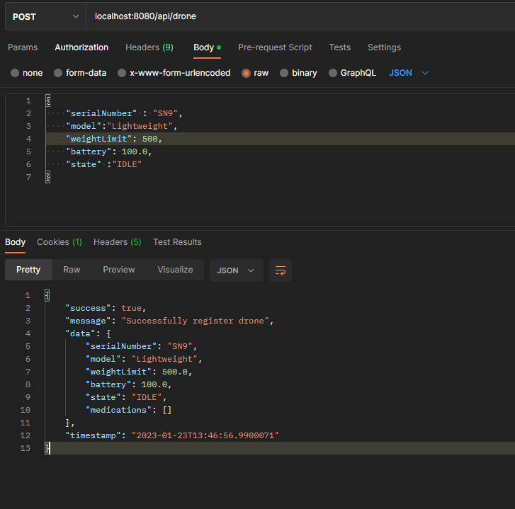
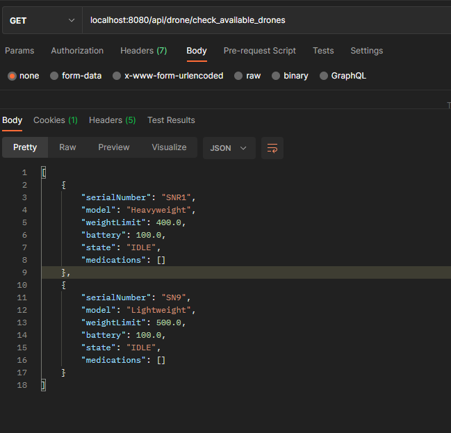
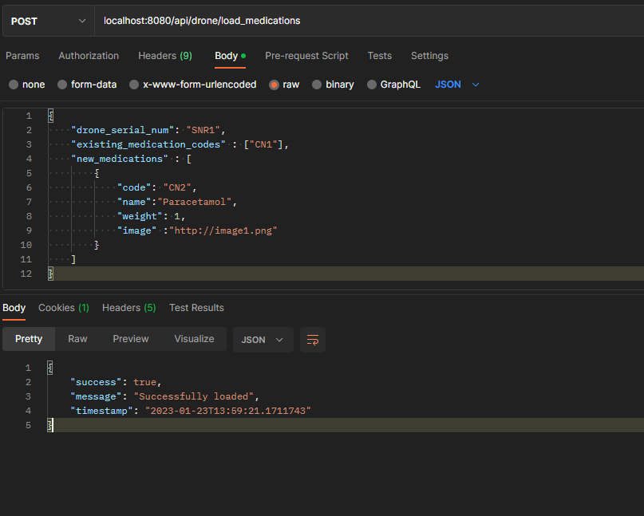
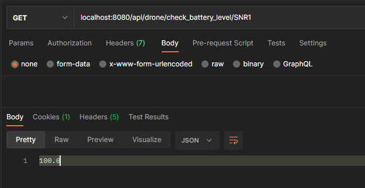
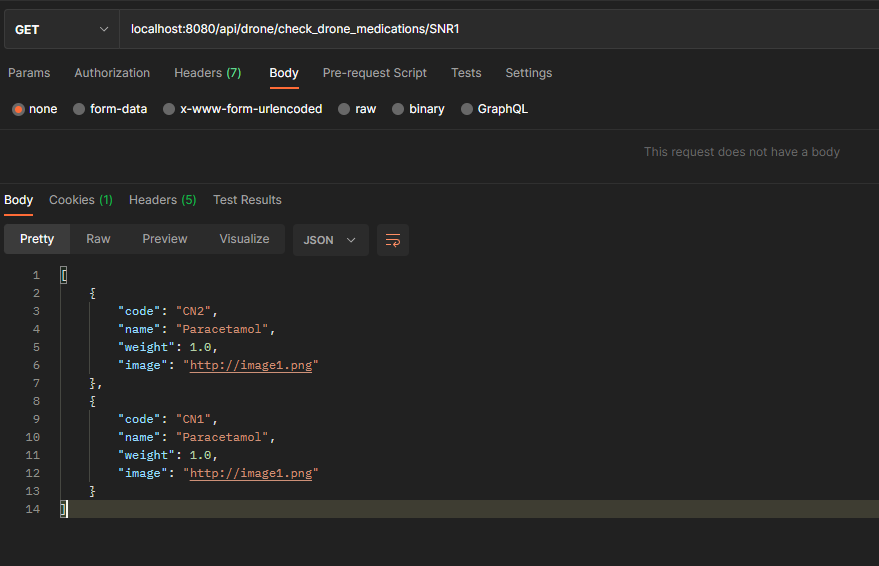

Introduction
There is a major new technology that is destined to be a disruptive force in the field of transportation: the drone. Just as the mobile phone allowed developing countries to leapfrog older technologies for personal communication, the drone has the potential to leapfrog traditional transportation infrastructure.
Useful drone functions include delivery of small items that are (urgently) needed in locations with difficult access.

Task description
We have a fleet of 10 drones. A drone is capable of carrying devices, other than cameras, and capable of delivering small loads. For our use case the load is medications.

**A Drone has:**

serial number (100 characters max);
model (Lightweight, Middleweight, Cruiserweight, Heavyweight);
weight limit (500gr max);
battery capacity (percentage);
state (IDLE, LOADING, LOADED, DELIVERING, DELIVERED, RETURNING).

**Each Medication has:**

name (allowed only letters, numbers, ‘-‘, ‘_’);
weight;
code (allowed only upper case letters, underscore and numbers);
image (picture of the medication case).
Develop a service via REST API that allows clients to communicate with the drones (i.e. dispatch controller). The specific communicaiton with the drone is outside the scope of this task.

The service should allow:

1. registering a drone;
2. loading a drone with medication items;
3. checking loaded medication items for a given drone;
4. checking available drones for loading;
5. check drone battery level for a given drone;
6. Feel free to make assumptions for the design approach.

**Requirements**
While implementing your solution please take care of the following requirements:

**Functional requirements**
There is no need for UI;
Prevent the drone from being loaded with more weight that it can carry;
Prevent the drone from being in LOADING state if the battery level is below 25%;
Introduce a periodic task to check drones battery levels and create history/audit event log for this.
**Non-functional requirements**
Input/output data must be in JSON format;
Your project must be buildable and runnable;
Your project must have a README file with build/run/test instructions (use DB that can be run locally, e.g. in-memory, via container);
Required data must be preloaded in the database.
JUnit tests are optional but advisable (if you have time);
Advice: Show us how you work through your commit history.

**Project Solution:**

1. Clone the project from the github repo : https://github.com/nyanick/drone-api.git
2. Import or open the project from any IDE of your choice (preferably IntelliJ Idea) as a maven project
3. Ensure all Maven dependencies are downloaded
4. Run a test on your project, to confirm everything is well setup
5. 5The database is h2 database, an in memory database, already configured in the application.properties file
6. Now start your springboot project

**Assumptions**
* We can load a drone with existing medication already register, likewise we can load a drone with new medication not existing in the system
* Our cron runs every 2 minutes checking the Battery level
* Security has not been implemented to protect our API, future work maybe
* We implemented CRUD API operations for Drone and Medications but we would describe just the functional test cases from the specification

Our Application has been configure to run on port 8080.
_The API endpoint is http://localhost:8080/api/_

**_API documentation and test cases as describe from specification:_**
**Drone Services**

1. [ ] **Register a drone:** 
POST request : http://localhost:8080/api/drone
``
`Body :
        {
            "serialNumber" : "SN1",
            "model":"Lightweight",
            "weightLimit": 5000,
            "battery": 100.0,
            "state" :"IDLE"
        }
``
``
Response:
        {
            "success": true,
            "message": "Successfully register drone",
            "data": {
            "serialNumber": "SN9",
            "model": "Lightweight",
            "weightLimit": 500.0,
            "battery": 100.0,
            "state": "IDLE",
            "medications": []
            },
            "timestamp": "2023-01-23T13:46:56.9900071"
        }
``

**See the image below from postman**

1. [ ] **Check Available Drone**

   GET request : http://localhost:8080/api/drone/check_available_drones

    Response:
    [
        {
            "serialNumber": "SNR1",
            "model": "Heavyweight",
            "weightLimit": 400.0,
            "battery": 100.0,
            "state": "IDLE",
            "medications": []
        },
        {
            "serialNumber": "SN9",
            "model": "Lightweight",
            "weightLimit": 500.0,
            "battery": 100.0,
            "state": "IDLE",
            "medications": []
        }
    ]

1. [ ] **Load a drone:**
   GET request : http://localhost:8080/api/drone/load_medications

    `Body : {}
    `
``    Response:
   {
   "success": true,
   "message": "Successfully loaded",
   "timestamp": "2023-01-23T13:59:21.1711743"
   }`
    ``

1. [ ] **Check Battery Level of a drone:**
   GET request : http://localhost:8080/api/drone/check_battery_level/{serial_numuber}

   `Body :
   {}
   `
   ``    Response:
   {
    100.0
   }`
   ``

1. [ ] **Check Medications of a drone:**
   GET request : http://localhost:8080/api/drone/check_drone_medications/{serial_numuber}

   `Body :
   {}
   `
   ``    Response:
   [
   {
   "code": "CN2",
   "name": "Paracetamol",
   "weight": 1.0,
   "image": "http://image1.png"
   },
   {
   "code": "CN1",
   "name": "Paracetamol",
   "weight": 1.0,
   "image": "http://image1.png"
   }
   ]`
   ``

